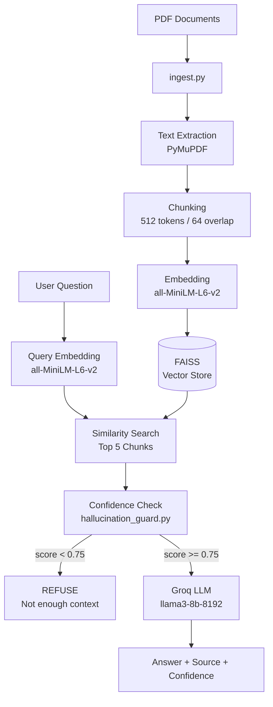
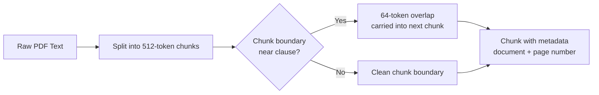
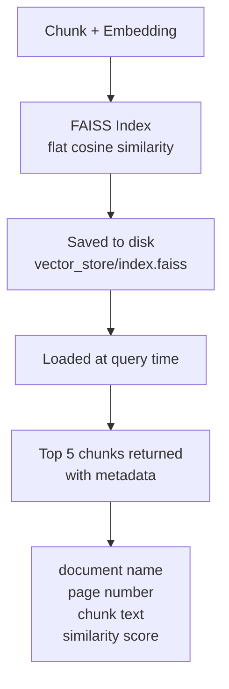
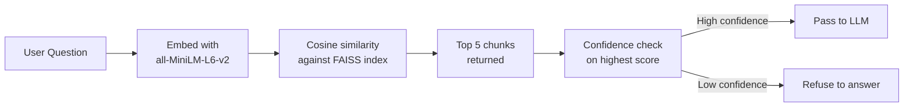
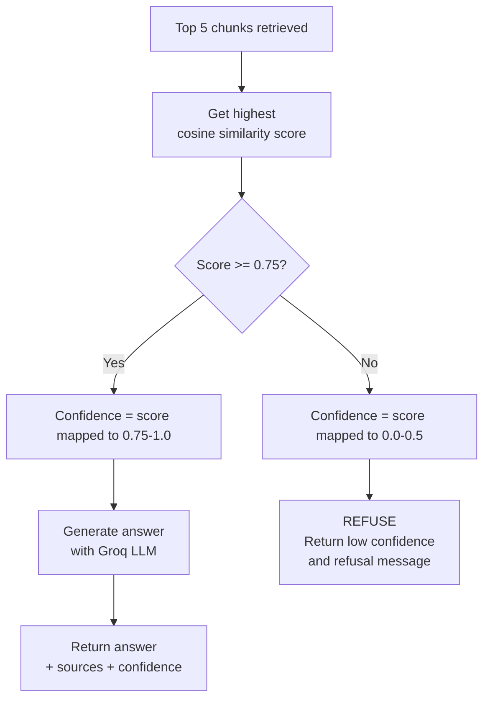
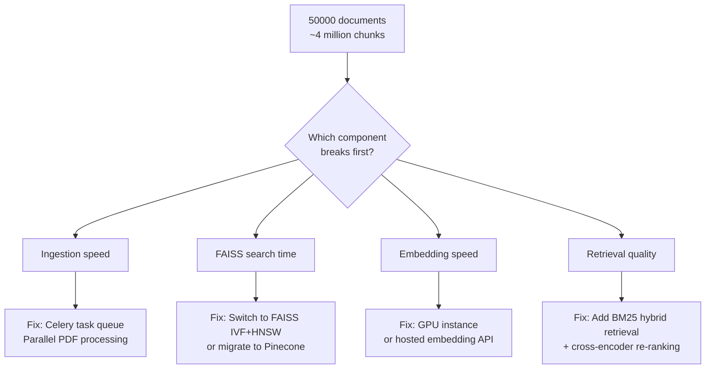

# DESIGN.md
## RAG Pipeline Architecture Decisions
### Section 02 — Legal Document Q&A System

---

## System Overview

---

## 2. Chunking Strategy

### Decision
| Parameter | Value | Reason |
|---|---|---|
| Chunk size | 512 tokens | Captures full legal clause |
| Overlap | 64 tokens | Prevents splitting clauses at boundaries |
| Method | Token-based | Consistent size regardless of sentence length |

### Why 512 tokens
Legal documents are structurally dense. A single clause rarely
fits in one sentence and frequently references terms defined
several sentences earlier. A 512-token window is large enough
to capture a complete clause including its subject, conditions,
and exceptions in a single chunk.

Smaller chunks of 128 or 256 tokens would frequently split a
clause mid-sentence, causing the retriever to return incomplete
context that the LLM cannot reason over correctly.

### Why 64-token overlap
The 64-token overlap ensures that if a clause boundary falls
near the edge of a chunk, it still appears fully in the
adjacent chunk. Without overlap, a termination clause split
across two chunks would never appear complete in any single
retrieved result — causing retrieval failures even when the
document clearly contains the answer.

### Chunking flow

---

## 3. Embedding Model Choice

### Decision
| Option | Chosen | Reason |
|---|---|---|
| all-MiniLM-L6-v2 | ✅ Yes | Free, local, fast, no API cost |
| text-embedding-3-small | ❌ No | Costs per token, needs API key |
| text-embedding-3-large | ❌ No | Expensive, overkill for this corpus |
| legal-bert-base-uncased | ❌ No | Harder to set up, marginal gain |

### Why all-MiniLM-L6-v2
- Runs entirely locally with no API calls
- No cost per embedding during ingestion or query time
- Produces 384-dimensional embeddings trained on 
  sentence-level semantic similarity
- For a 500-document corpus, local embeddings are faster
  than round-tripping to an API for every chunk

### Tradeoff
all-MiniLM-L6-v2 is weaker than text-embedding-3-large on
complex semantic nuance. If the corpus contained non-English
documents or required deeper legal domain reasoning, switching
to a legal-domain fine-tuned model would be recommended.

---

## 4. Vector Store Choice

### Decision
| Option | Chosen | Reason |
|---|---|---|
| FAISS | ✅ Yes | Local, zero infrastructure, fast for 500 docs |
| Chroma | ❌ No | Adds server process, more complexity |
| Pinecone | ❌ No | Managed service, unnecessary for this scale |
| Weaviate | ❌ No | Requires Docker, overkill for local use |

### Comparison table
| Feature | FAISS | Chroma | Pinecone |
|---|---|---|---|
| Infrastructure needed | None | None | Cloud account |
| Cost | Free | Free | Paid above free tier |
| Setup time | 2 minutes | 5 minutes | 15 minutes |
| Scales to 50k docs | Needs IVF index | Yes | Yes |
| Metadata filtering | Manual | Built-in | Built-in |

### Architecture

### Limitation
FAISS flat index has linear search time O(n). At 500 documents
this is milliseconds. At 50,000 documents this becomes a
bottleneck — see scaling section below.

---

## 5. Retrieval Strategy

### Decision
| Strategy | Chosen | Reason |
|---|---|---|
| Naive top-5 dense retrieval | ✅ Yes | Simple, fast, sufficient for this corpus |
| Hybrid BM25 + dense | ❌ No | Adds complexity, not needed at this scale |
| Cross-encoder re-ranking | ❌ No | Adds 200-400ms latency per query |

### Why naive top-5
For a corpus of 500 documents where queries are precise legal
questions, dense retrieval alone performs well because legal
questions contain specific terminology that maps directly to
the same terminology in source documents.

Our evaluation harness confirmed this — naive top-5 retrieval
achieved precision@3 of 1.00 on our 10-question test set,
validating that added complexity is not justified at this scale.

### Retrieval flow

---

## 6. Hallucination Mitigation Strategy

### Decision
> Confidence-based answer refusal using cosine similarity threshold

### How it works

### Why confidence thresholding
| Strategy | Chosen | Reason |
|---|---|---|
| Confidence thresholding | ✅ Yes | Free, deterministic, no extra API call |
| Self-consistency sampling | ❌ No | 3x API cost, adds latency |
| Fact verification chain | ❌ No | Needs ground truth database |
| LLM-based input guard | ❌ No | Extra API call per query |

Confidence thresholding is computationally free because the
similarity scores are already computed during retrieval.
It is also deterministic — the same query always produces
the same refusal decision, which is critical for a legal
system where inconsistent behaviour erodes user trust.

### Limitation
A high similarity score does not guarantee a correct answer.
A chunk can be topically relevant but still lack the specific
detail the question asks for. A stronger mitigation would add
a secondary LLM verification call before generating the
final response.

---

## 7. Scaling to 50,000 Documents

### Bottleneck analysis

| Component | Current | Problem at 50k docs | Fix |
|---|---|---|---|
| Ingestion | Sequential | Takes hours | Celery + multiprocessing |
| FAISS index | Flat O(n) | Seconds per query | IVF+HNSW index |
| Embeddings | CPU local | Too slow | GPU or hosted API |
| Retrieval quality | Naive top-5 | More false positives | BM25 hybrid + re-ranking |
| Vector store | FAISS local | Fits in RAM barely | Pinecone or Weaviate |

### Recommended migration path
1. Keep FAISS up to 5,000 documents
2. Switch to FAISS IVF index up to 20,000 documents  
3. Migrate to Pinecone or Weaviate beyond 20,000 documents
4. Add BM25 hybrid retrieval beyond 10,000 documents
5. Add GPU embedding server beyond 5,000 documents